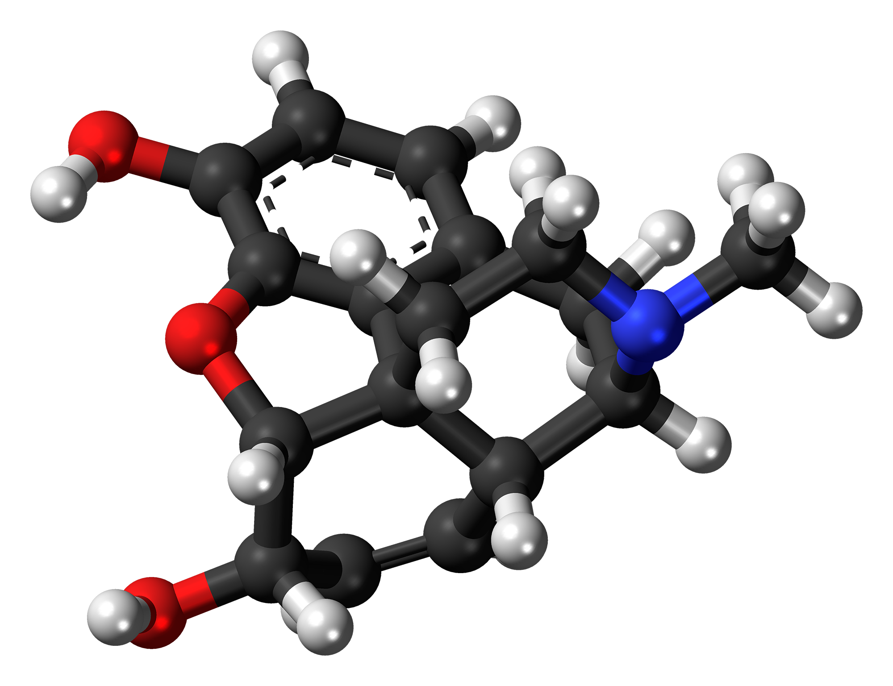

# Loading protein pdb-files into Blender

## Setup

 * Blender version 4.0
 * Blender file: 

## Install addons

Go to Edit/Preferences --> Add-ons 

Install Atomic Blender PDB/XYZ

## Import pdb file

shortcut `X` and delete the cube.

Menu File --> Import --> PDB file

Import morphine.pdb

## Play with model and make a render

Outliner morphine.pdb to select atoms and stics

Play with Hide in viewport and/or in renders

Change the camera position selecting it in outliner

Toggle camera View (Numpad 0 or Button top right in layout)

`GZZ` or other axis to move the camera

`F12` or render view to make a nice photo

Atmoic Blender Utilities in Create menu on top right (undeer tools) `N` key to toggle

Reference is 

On Utility Panel:

set Carbon, Oxygen and Nitrogen spheres radius in pm to 40.0

## Change materials

Change atoms colors from material panel.

All atoms: .25 metallic .25 rough

## Add a plane

Camera view Numpad 0

`SHIFT-A` add plane mesh

Select camera, select plane with `SHIFT` hold

Press `N` Item panel Z rotation, right click copy single to selected to algin plane to camera

Grab and move down, scale

Edit mode, edge mode, select far edge `EZ` extrude on Z axis

Select middle edge

`CTRL-B` to bevel, move mouse, mouse wheel to increse segmentation

APPLY SCALE! `CTRL-A`

Test Render

Remove shadowns on Light object

## References

 * [Luminous Lab - Import pdf files](https://www.youtube.com/watch?v=3nCeQErv8Fg)
 * http://www.malte-reimold.de/blender/pdb2blend.html
 * [Low poly planet tutorial - Background Plane](https://www.youtube.com/watch?v=8FXJJDFAL6o)

