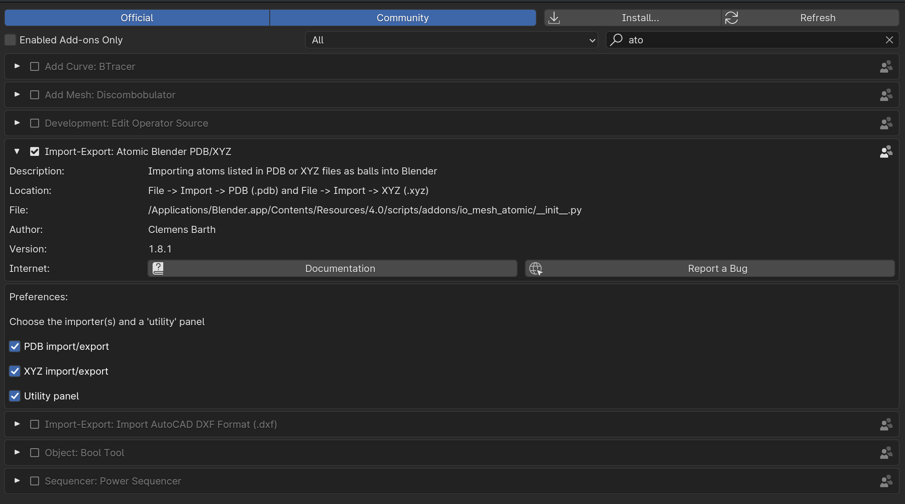
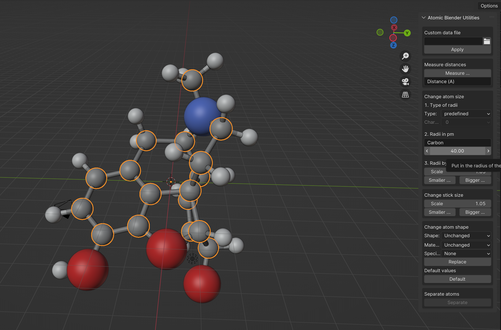

## LOAD A PDB FILE

### Setup

 * Blender version 4.0
 * Blender empty file

### Workflow

1. Delete the cube with `X`
2. In `Edit` --> `Preferences` --> `Add-ons` Activate Atomic Blender and flag also the Utility Panle checkbox

    

3. In `File` --> `Import` --> `PDB file`
4. Import file [morphine.pdb](https://raw.githubusercontent.com/tucano/blender4science/main/course_material/Atomic_Blender/01_load_pdb/morphine.pdb)
5. In Outlier explore morphine.pdb collection, atoms are divided by types.
6. Press `N` to activate the Atomic Blendser Utilities (under Create)
7. The interface of this panel is a little bit weird: you must set the atmon name (Es: Carbon) and the radius in pm.

    

8. Set the radius of Carbon, Oxygen and Nitrogen to 40 pm 
9. Go to material preview mode (top right of main window)
10. Change the material of atoms, let's make everythng shine: `.25 metallic` and `.25 rough`
11. Let's add a curved plane to make a nice render, `SHIFT-A` to add a plane
12. To rotate the plane and align with camera do this: Select plane, select also camera with `CTRL-CLICK`
13. Press `N` Item panel Z rotation, right click copy single to selected to algin plane to camera.
14. Edit mode, edge mode, select far edge `EZ` extrude on Z axis
15. Select middle edge
16. `CTRL-B` to bevel, move mouse, mouse wheel to increse segmentation
17. With plane selected `Object` --> `Shade smooth`
18. Render your molecule!
