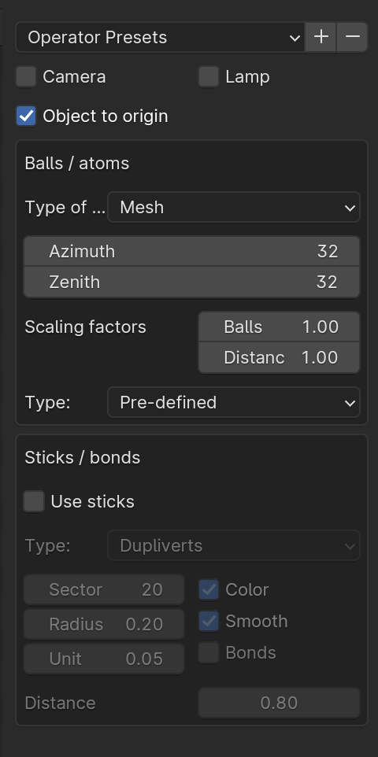

## LOAD A PDB FILE

### Setup

 * Blender version 4.0
 * Blender empty file

### PDB FILE

Dna molecule: 

[dna.pdb](https://raw.githubusercontent.com/tucano/blender4science/main/course_material/Atomic_Blender/03_DNA_pdb/dna.pdb)

### WORKFLOW

1. Delete the cube with `X`
2. Import file [dna.pdb](https://raw.githubusercontent.com/tucano/blender4science/main/course_material/Atomic_Blender/03_DNA_pdb/dna.pdb)
3. Import options:

    

4. In the outlier hide all except Oxygen atoms
5. Add to the Oxygen_ball mesh a subdivision modifier to increase sphere resolution
6. We try to make a shader with some roughness (noise) on the surface and possibly less shiny
7. Select the Oxygen_ball mesh and open the Material properties. There is a material named Oxygen
8. Go to shading mode: here we can control the shading using nodes and connections
9. Set the base color to: `344EFF` (Hex)
10. Roughness `1.0` and Metallic `0.0`
11. Add some noise: `SHIFT-A` and add a Noise texture: Rainbow noise!
12. Instead of a rainbow noise I want the noise on a specific color range (color ramp)
13. `SHIFT-A` and add a color ramp
14. Use this material for all ball mesh models
15. Remove the light with `X`
16. In properties Scene --> World set the Surface to use Nodes.
17. Move to Shading view
18. `SHIFT-A` to add a Sky Texture with mode Hosek/Wilkie (EEVE) and Ground albedo `0.35`
19. Move the view far away from the molecule
20. Align camera with view: select camera and `CTRL-ALT-Numpad0`
21. Increase clipping End to 2000 meters
22. Add a keyframe for the location of camera
23. Go to frame 100
24. Move camera forward on his Z axis with `GZZ`
25. Add a second keyframe

Blender file: [dna.blend](https://github.com/tucano/blender4science/raw/main/course_material/Atomic_Blender/03_DNA_pdb/dna.blend)

