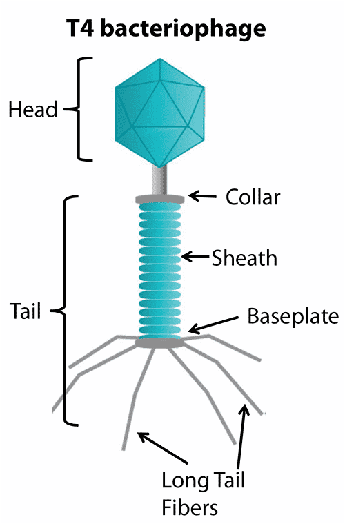
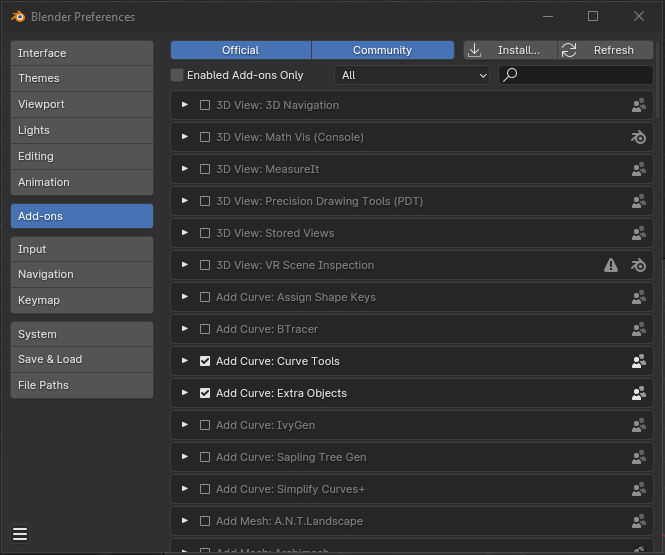
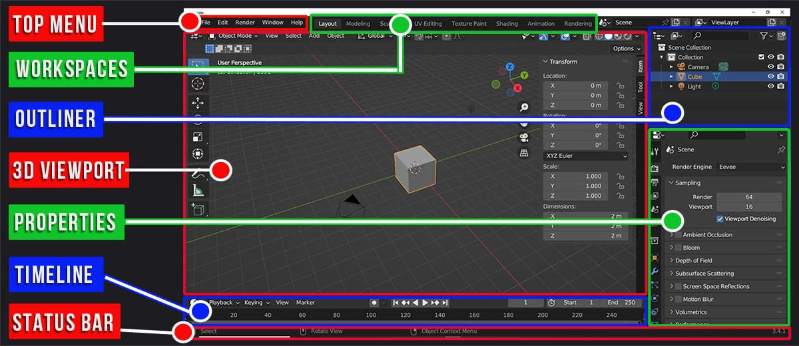
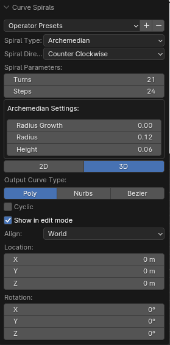
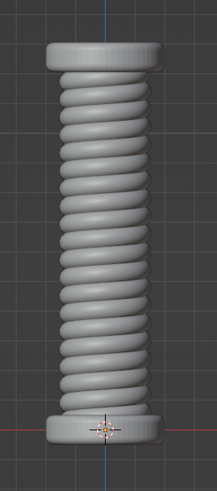
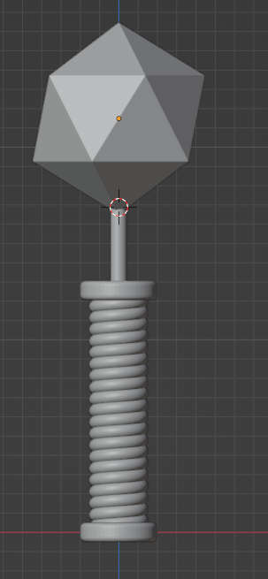

## BACTERIOPHAGE

Let's create a low poly model of a Bacteriophage.

Reference: 

### Setup

 * Blender version 4.0
 * Blender empty file

### Workflow

1. Delete the cube with `X`
2. In `Edit` --> `Preferences` --> `Add-ons` Activate Extra Objects and Curve Tools plugin for curves 

    

3. Go to front orthographic view with `NumPad 1` or using the [Navigation Gizmo](https://docs.blender.org/manual/en/latest/editors/3dview/navigate/introduction.html#navigation-gizmo) 

    

4. Add the reference: `SHIFT-A` add image reference `bacteriophage.png`
5. `GX` to move reference to the left
6. In the Outliner, Right mouse button (`RMB`) and add a collection named Virus

    

7. Add a Curve spiral archimedean

    

    | Parameter     | Value      |
    |:--------------|:-----------|
    | Turns         | 21         |
    | Steps         | 24         |
    | Radius Growth | 0.0        |
    | Radius        | 0.12       |
    | Height        | 0.06       |

8. In `Properties` --> `Data` --> `Geometry` --> `Bevel`, set depth to `0.035`
9. Add the baseplate, a cylinder with `64` vertex, Radius `.2` and depth `.1`.
10. Edit mode with `TAB` and press `2` for edge select
11. Select edge loops top and bottom `ALT-LMB` and `SHIFT-ALT-LMB`
12. `CTRL-B` and Bevel increasing steps with mouse wheel
13. Duplicate for collar with `SHIFT-D`
14. `GZ` to grab and move up collar
    
        

15. Edit mode with `TAB` and press `3` for face select
16. Select top face of collar, extrude with `E` in place and scale, then extrude again to make the 'neck'
17. With top face of neck selected: `SHIFT-S` and `2` for cursor to selected
18. Object Mode with `TAB`
19. Add Head icosphere with `SHIFT-A` subdivisions `1` and Radius `0.5`
20. Move Head up with `GZ`

        

21. 