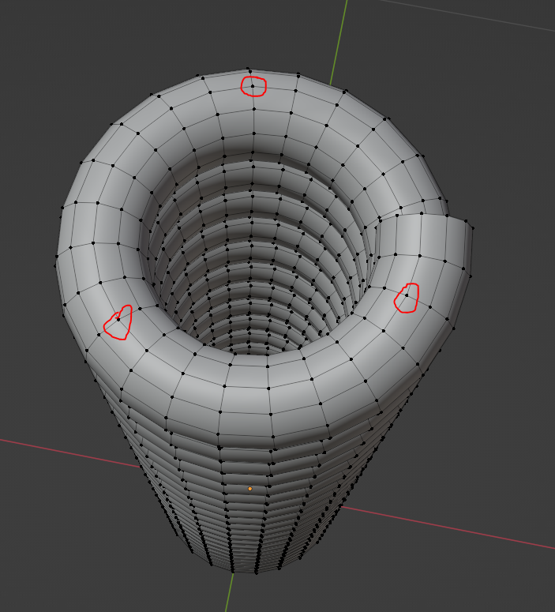
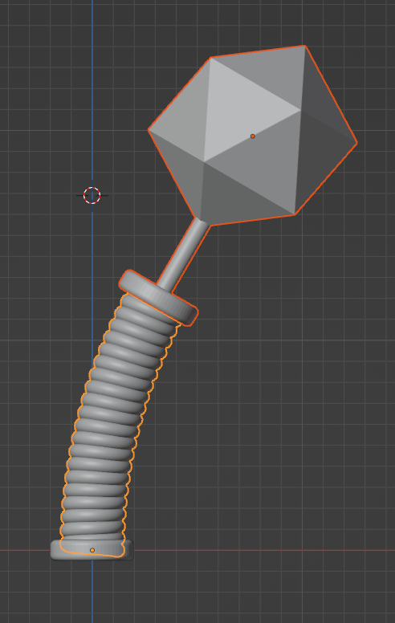
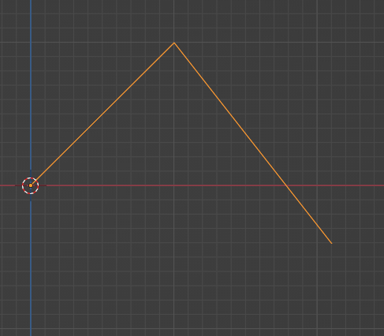
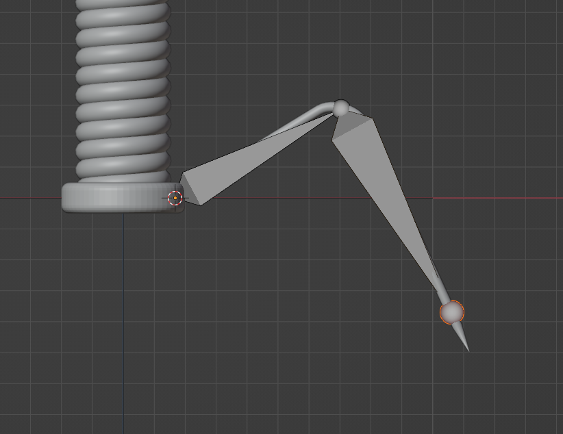
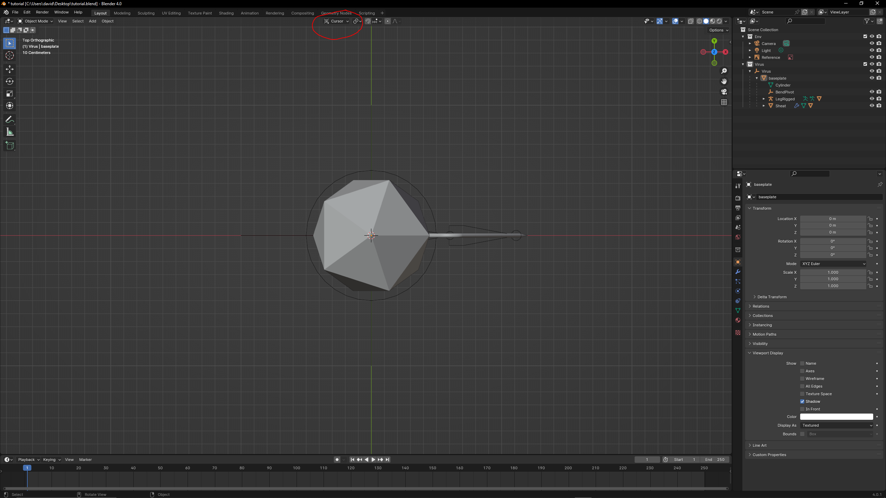

## BACTERIOPHAGE

Let's create a low poly model of a Bacteriophage.

Reference: 


### Setup

 * Blender version 4.0
 * Blender empty file

### Workflow

1. Delete the cube with `X`
2. In `Edit` --> `Preferences` --> `Add-ons` Activate Extra Objects and Curve Tools plugin for curves 

    

3. Go to front orthographic view with `NumPad 1` or using the [Navigation Gizmo](https://docs.blender.org/manual/en/latest/editors/3dview/navigate/introduction.html#navigation-gizmo) 

    

4. Add the reference: `SHIFT-A` add image reference `bacteriophage.png`
5. `GX` to move reference to the left
6. In the Outliner, Right mouse button (`RMB`) and add a collection named Virus

    

7. Add a Curve spiral archimedean

    

    | Parameter     | Value      |
    |:--------------|:-----------|
    | Turns         | 21         |
    | Steps         | 24         |
    | Radius Growth | 0.0        |
    | Radius        | 0.12       |
    | Height        | 0.06       |

8. In `Properties` --> `Data` --> `Geometry` --> `Bevel`, set depth to `0.035`
9. Add the baseplate, a cylinder with `64` vertex, Radius `.2` and depth `.1`.
10. Edit mode with `TAB` and press `2` for edge select
11. Select edge loops top and bottom `ALT-LMB` and `SHIFT-ALT-LMB`
12. `CTRL-B` and Bevel increasing steps with mouse wheel
13. Duplicate for collar with `SHIFT-D`
14. `GZ` to grab and move up collar
    
        

15. Edit mode with `TAB` and press `3` for face select
16. Select top face of collar, extrude with `E` in place and scale, then extrude again to make the 'neck'
17. With top face of neck selected: `SHIFT-S` and `2` for cursor to selected
18. Object Mode with `TAB`
19. Add Head icosphere with `SHIFT-A` subdivisions `1` and Radius `0.5`
20. Move Head up with `GZ`

        

21. Join collar and head: select collar in the Outliner, `SHIFT-LMB` to select also head. Contextual menu with `RMB` and Join (shortcut: `CTRL-J`)
22. Select Sheath and `F3` convert to mesh (or `Object` --> `Convert` --> `Mesh`)
23. In `Properties` --> `Modifiers` Add simple deform modifier to the Sheath
24. Bend `0` degrees
25. Test the bending changing the bend value and the axis. 
26. We need to connect the head now
27. Select Sheat and go to Edit mode with `TAB`
28. select 3 top vertex in the middle line of coil

        

29. `CTRL` click Head
30. `CTRL-P` and make vertex parent
31. Test the bending changing the bend value and the axis. Head should Bend with Sheat

    

32. `SHIFT-S` and move cursor to origin
33. With `SHIFT-A` add and Empty object to origin named it BendPivot
34. Set as Origin for the bend modifier, now we can rotate and bend!
35. In the Outliner, hide the Virus collection (eye icon)
36. Go to front orthographic view to make the Long Tail Fibers (legs)
37. `SHIFT-A` --> `Curve` --> `Point`
38. You are now in Edit Mode press `E` to add a point for mid leg, press `E` again for second point

    

39. Select mid point
40. `N` Edit Fillet/Chamfer
41. In `Properties` --> `Data`, Set Geometry Bevel to `0.035`
42. Go back to Object Mode with `TAB` and convert leg to mesh with `F3`
43. Select edgee loop at the end with `ALT-LMB` press `F` to close
44. `3` for face select and extrude the new face, `LMB` to confirm
45. `S0` to scale at `0` the tip of the leg
46. Go back to object mode and activate visibility for the virus collection
47. Scale the leg with `S`
48. In Outlier move leg to virus collection with `M`
49. Go to Object mode and select leg
50. With leg selected and in Object Mode, `SHIFT-S` and move cursor to selected
51. `SHIFT-A` and add an Armature
52. Enter edit mode position top of bone in the middle of leg with `G`
53. Extrude and put at end of second bone at the tip of the leg

    

54. Back to Object Mode
55. Select leg
56. `CTRL-LMB` select armature
57. `CTRL-P` parent leg to Armature with Automatic weights
58. In `Properties` --> `Object` set bones Object properties display as wire
59. Move armature to virus collection
60. We now have a rigged leg! Go to Pose Mode, select bones and test the leg poses
61. Go back to Object Mode
62. Select Sheat, `CTRL` select Bend pivot and parent with `CTRl-P`
63. Parent Bend pivot to baseplate. Current objects parenting:

    ```mermaid
    graph TD;
        Baseplate-->Sheat-->Head;
    ```

64. `SHIFT-S` cursor to world origin
65. `SHIFT-A` inside Virus collection add an empty sphere with radius `0.5`. Name the object "virus" (model control point)
66. Parent baseplate to control point: `LMB`select baseplate, `CTRL-LMB` select virus control point, `CTRL-P` and parent object.
67. Current objects parenting:

    ```mermaid
    graph TD;
        Virus-->Baseplate-->Sheat-->Head;
    ```

68. Go on top view with `NumPad 7` or navigation gizmo
69. Parent rigged leg to baseplate:

    ```mermaid
    graph TD;
        Virus-->Baseplate-->Sheat-->Head;
        Baseplate-->Armature-->Leg
    ```

    

70. Transform orientations to 3D cursor on top of 3D Viewport

    

71. Select Armature and Leg (with `CTRL` cick), Duplicate with `D` and Rotate 45 with `R45`


[bacteriophage.blend](https://github.com/tucano/blender4science/raw/main/course_material/Bacteriophage/bacteriophage.blend)