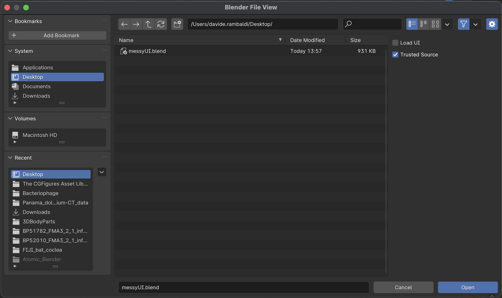

## Reset the Blender UI

If you end up with a messy UI like this one:

Use this workflow to reset the UI:

1. Save the messy UI file
2. `File` --> `New` --> `General` and open a new empty file 
3. `File` --> `Open` and select your messy UI file
4. In the open options (use the little triangle on top right) deselect `Load UI` 
5. Open the file, the UI is resetted to the default