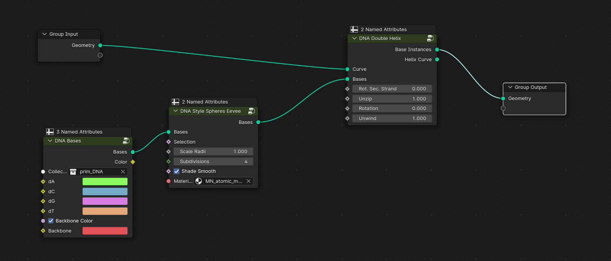

## DNA IN MOLECULAR NODES

### Setup

 * Blender version 4.0
 * Blender empty file
 * Molecular Nodes installed

### WORKFLOW

1. As usual we delete the cube with `X`
2. Go to top orthographic view `Numpad 7`
3. `SHIFT-A` and add bezier curve
4. Got to EDIT mode (`TAB`)
5. Add some points to the curve using extrude (`E`)
6. Go back to Object Mode
7. With the bezier curve selected go to Geometry Node view. [Geometry Nodes](https://docs.blender.org/manual/en/latest/modeling/geometry_nodes/index.html)
8. Press New on geometry nodes interface
9. `SHIFT-A` and add DNA Double Helix
10. To see the helix curve you can connect the Helix Curve to the geometry output.
11. To see the real bases I need to define a new block: `SHIFT-A` and add DNA Bases. Notice that a new collection is now present in the Outlier: `prim_DNA`
12. In order to render the bases a sphere we can add to geometry nodes structure a block named `DNA Style Spheres Eevee`
    
    

13. Now edit the bezier curve and reduce the number of points
14. We now create a simple animation to unwind the DNA using geometry nodes parameters: in geometry nodes at frame 1 add a Keyframe for `unwind` (1.0) and `zip` (1.0) parameters
15. Move to frame 100 and change `unwind` to 0.0 and `zip` to 2.5
16. Look at this totally non scientific unwind animation of DNA!

Blender file: [DNA_MolecularNodes.blend](https://github.com/tucano/blender4science/raw/main/course_material/MolecularNodes/DNA_MolecularNodes.blend)
