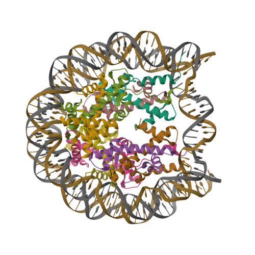
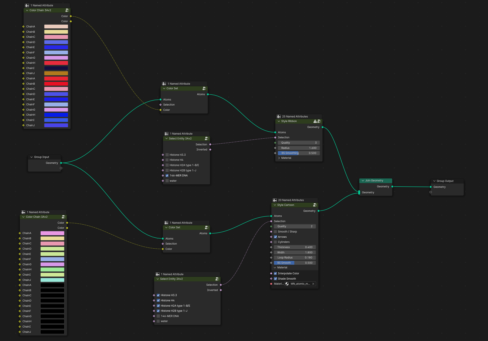
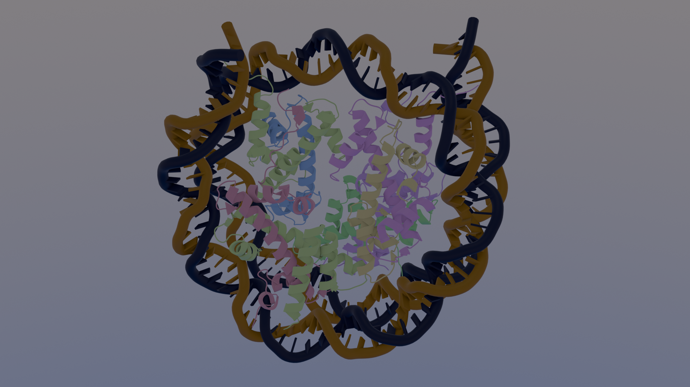

## NUCLEOSOMES

### Setup

 * Blender version 4.0
 * Blender empty file
 * Molecular Nodes installed

### Reference

### Workflow

1. As usual we delete the cube with `X`
2. Load PDB model 3av2 with default Preset
3. Wipe out all block from geometry nodes and create this blocks:

    

4. Render the image:

    