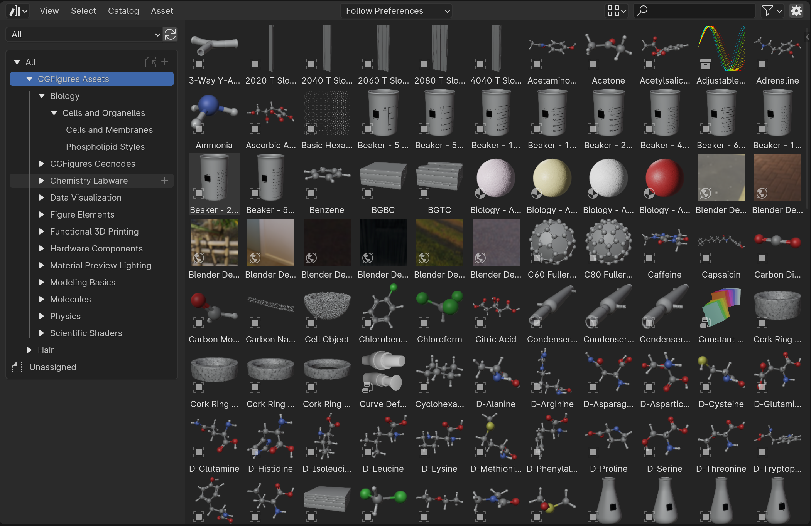

## CGFigures tutorials

From Dr. Joseph G. Manion, a collection of tutorials on Blender for scientists.

 * [CGFigures YouTube Channel](https://www.youtube.com/@CGFigures/videos){:target="_blank"}

 * [Blender and Science serie](https://www.youtube.com/watch?v=AEIPcyNDTv8&list=PLcKSD7d0T-HADHS9DHsIfMhso8FLIkReM){:target="_blank"}

## CGFigures Asset Library

There is also a huge asset library with interesting resources: 

[CGFigures Assets Library](https://drive.google.com/file/d/13XNjSc-1tvu_PbYemllN7nUGf7vqGc1O/view?usp=sharing){:target="_blank"}

To install the library in your Blender instance:

1. Download and unzip the library
2. Move the library somewhere (in OSX I can suggest: `~/Documents/Blender/`)
3. Open Blender
4. Go to `Edit` --> `Preferences` --> `File Paths` --> `Asset Libraries`
5. Set as Import Method `Append` (without Reuse)
6. Save preferences
7. Open a window with asset browser: you now have a huge library of scientific models!

Video tutorial on how to use the library in your project:



